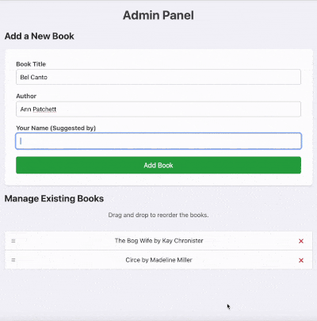
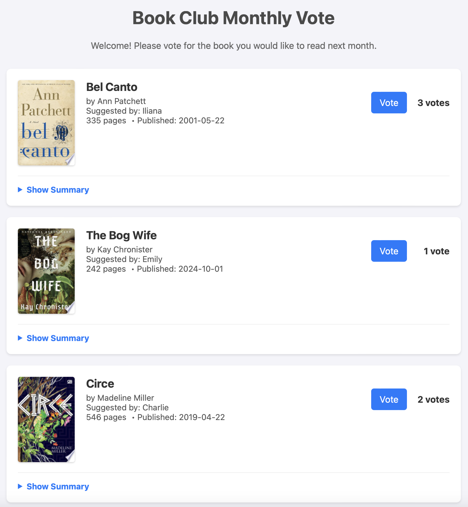

# Book Club Voting App

## 📖 Project Description

This project is a multi-page web application designed for a book club to easily vote on their next book. The application provides a public-facing area for members to view the book list and vote, and a separate, password-protected admin panel for managing the book list. The goal is to provide a straightforward and user-friendly interface with a clear separation between user and administrator capabilities.

## ⭐ Key Features in Action

The admin panel provides full control over the book list, including adding, deleting, and reordering books via drag-and-drop. The public voting page allows members to easily cast their votes.

| Admin Panel (Add, Delete, Reorder)            | Public Voting Page                        |
| --------------------------------------------- | ----------------------------------------- |
|  |  |

## 🏗️ Software Architecture

The application is built with a clean, scalable structure that separates concerns using Flask Blueprints and a centralized configuration.

*   **`config.py`:** Centralizes application configuration. It loads sensitive data like the `SECRET_KEY` and `ADMIN_PASSWORD` from environment variables for improved security.
*   **`app.py`:** The main entry point for the Flask application. It initializes the app, loads the configuration, and registers the application's blueprints.
*   **`src/` directory:** Contains the core backend logic, organized into blueprints and data modules.
    *   **`admin.py`:** A Flask Blueprint that encapsulates all administrative functionality, including login, logout, and all book management routes (add, delete, reorder).
    *   **`books.py`:** Defines the `Book` and `BookStore` classes, managing all data loading, saving, and in-memory storage in an object-oriented way.
*   **`templates/`:** Contains all Jinja2 HTML templates, including a `base.html` for a consistent layout across all pages.
*   **`static/`:** Contains all frontend assets.
    *   **`css/`:** CSS is organized into a component-based structure (`_navbar.css`, `_forms.css`, etc.) and imported into a single `main.css` file for maintainability.
    *   **`js/`:** Contains the client-side JavaScript for handling dynamic features like voting and admin actions.

## 💻 Technology Stack

*   **Backend:** Python with the **Flask** web framework.
*   **Frontend:** Vanilla **HTML**, **CSS**, and **JavaScript**.
*   **Data Storage:**
    *   A static `data/books.json` file is used as the database for the book list.
    *   **Flask Sessions** are used for admin authentication.
    *   Vote counts are stored in-memory on the server.

## 🚀 Local Setup and Installation

1.  **Clone the repository:**
    ```bash
    git clone <your-repository-url>
    cd book_club_voting
    ```

2.  **Create and activate a virtual environment:**
    ```bash
    python3 -m venv venv
    source venv/bin/activate
    ```

3.  **Install dependencies:**
    ```bash
    pip install -r requirements.txt
    ```

4.  **Create the environment file:** Create a file named `.env` in the project root and add the following variables. This file is ignored by Git.
    ```
    # .env
    SECRET_KEY='generate-a-long-random-string-for-this'
    ADMIN_PASSWORD='your-chosen-admin-password'
    ```

5.  **Run the application:**
    ```bash
    flask run
    ```
    The application will be available at `http://127.0.0.1:5000`.