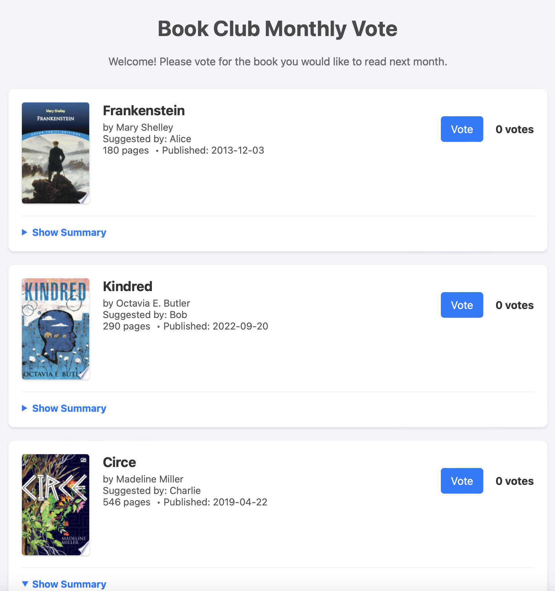

# Book Club Voting App

## 📖 Project Description

This project is a simple, single-page web application designed for a book club to easily vote on their next book. The goal is to provide a straightforward and user-friendly interface that requires no login or complex setup. The application displays a list of suggested books—now with rich details like cover images and summaries—allows members to cast votes, and shows the results in real-time.

  

## ⭐ Features

*   **Rich Book Display:** Displays a list of books with detailed information including cover image, title, author, summary, page count, and who suggested it.
*   **Data Enrichment:** Includes a utility script that uses the Google Books API to automatically fetch and add detailed information to the book list.
*   **Live Voting:** Users can click a "Vote" button next to each book. The vote is registered on the backend without needing a page refresh.
*   **Real-Time Results:** Vote counts next to each book are updated dynamically as votes are cast.
*   **Export to CSV:** A simple "Export Results" button allows users to download the current vote counts as a `.csv` file for easy record-keeping.

## 🏗️ Software Architecture

The application is built with a clean, scalable structure that separates concerns:

*   **`app.py`:** The main entry point for the Flask application. It handles routing and serves the web pages.
*   **`src/` directory:** Contains the core backend logic.
    *   **`books.py`:** Defines the `Book` and `BookStore` classes, managing all data loading and in-memory storage in an object-oriented way.
    *   **`utils.py`:** Contains utility scripts, such as the function to enrich book data from the Google Books API.
*   **`templates/`:** Contains the HTML templates rendered by Flask.
*   **`static/`:** Contains all frontend assets (CSS, JavaScript).

## 💻 Technology Stack

*   **Backend:** Python with the **Flask** web framework.
*   **Frontend:** Vanilla **HTML**, **CSS**, and **JavaScript** (no frameworks).
*   **APIs:** Uses the **Google Books API** to enrich book data.
*   **Data Storage:**
    *   A static `data/books.json` file is used to define the initial list of books.
    *   Vote counts are stored in-memory on the server, meaning they will reset whenever the application is restarted.